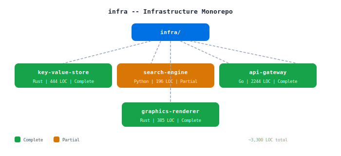

# infra

Infrastructure project monorepo. Four standalone projects covering persistence, search, networking, and graphics.



## Projects

| Project | Language | LOC | Status | Description |
|---------|----------|-----|--------|-------------|
| [key-value-store](./key-value-store) | Rust | 444 | Complete | Persistent KV database (Bitcask-style). Log-structured storage, crash recovery, TCP server |
| [search-engine](./search-engine) | Python | 196 | Partial | TF-IDF search engine. Indexer + CLI working; crawler, BM25, REST API incomplete |
| [api-gateway](./api-gateway) | Go | 2244 | Complete | Production-ready API gateway. Routing, rate limiting, load balancing, health checks |
| [graphics-renderer](./graphics-renderer) | Rust | 385 | Complete | Ray tracer with Phong lighting, shadows, reflections. PPM/PNG output |

## Quick Start

```bash
# Key-value store
cd key-value-store && cargo run

# Search engine
cd search-engine && pip install -r requirements.txt && python -m src.query.search "query"

# API gateway
cd api-gateway && go run main.go -mode gateway

# Graphics renderer
cd graphics-renderer && cargo run
```

## License

MIT 2026 Joshua Trommel
