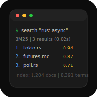

# Search Engine


TF-IDF + BM25 local search engine. Crawl, index, query.

## Scope

- Local file indexing with BFS web crawler (robots.txt aware)
- Inverted index with BM25 scoring (K1=1.5, B=0.75)
- Boolean query parser (AND, OR, NOT, quoted phrases)
- JSON document store for persistence
- Flask REST API (`GET /search?q=`, `POST /index`)

## Quick Start

```bash
python3 -m venv .venv && source .venv/bin/activate
pip install -r requirements.txt

# Add some text files to data/
echo "The quick brown fox jumps over the lazy dog" > data/sample.txt

# Build the index
python -m src.indexer.index data/

# Search
python -m src.query.search "fox"
```

## Architecture

```
Crawler → Tokenizer → Inverted Index → Document Store
                             ↓
                       Query Parser → BM25 Ranker → REST API
```

**Ingestion pipeline** — builds the index:

1. Crawler fetches pages (BFS, robots.txt aware)
2. Tokenizer splits and normalizes text
3. Inverted Index maps terms to document postings
4. Document Store persists raw text as JSON

**Query pipeline** — answers searches:

5. Query Parser handles Boolean/phrase syntax
6. BM25 Ranker scores and sorts matching documents
7. REST API exposes `/search?q=` over HTTP

## Learning Goals

- Inverted index data structure (term → posting list)
- TF-IDF vs BM25 scoring algorithms
- Web crawler design + robots.txt politeness
- Boolean query parsing (AND, OR, NOT, phrases)
- Information retrieval fundamentals

## Code Stats

| Module | File | Status |
|--------|------|--------|
| Tokenizer | src/indexer/tokenizer.py | done |
| Inverted Index | src/indexer/index.py | done |
| BM25 Scoring | src/indexer/tfidf.py | done |
| Query Parser | src/query/parser.py | done |
| Ranker | src/query/ranker.py | done |
| Search CLI | src/query/search.py | done |
| Crawler | src/crawler/crawler.py | done |
| robots.txt | src/crawler/robots.py | done |
| Document Store | src/storage/store.py | done |
| REST API | src/server/api.py | done |

28 tests, 0 skipped.

## Pairs With

- **query-language** — SQL-style query frontend for structured search
- **key-value-store** — swap the JSON document store for a real KV backend
- **shell** — pipe search results through shell pipelines
